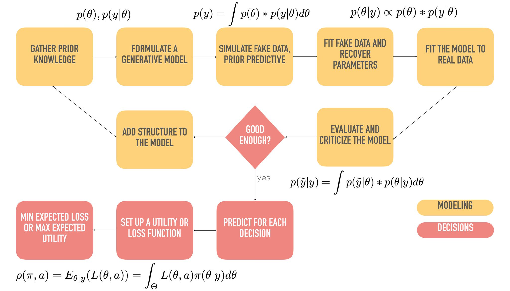

# Section 1: Bayesian refresher and Introduction to ArviZ

* Walk students through a Bayesian Analysis and showcase all portions of the Bayesian workflow.  
* Have students work together with instructor to gain confidence in seeing a full analysis.
* Showcase mini tutorial on how to setup a bayesian model in PyMC3 and PyStan.
* Explain how model fitting is easy with well written Probabilistic Programming
* Languages, but just because the software fits a model, it doesn’t mean the model is a good one
* Demonstrate how arrays of data are not well suited for communication or understanding

## Activities
### Instructor Do: Light Introduction to Bayes Theorem  (10 minutes)
* Introduce Bayes Theorem mathematical definition
* Talk through prior, posterior, likelihood, and evidence
* Start explaining globe example from Richard McElreath
  1. Hide picture of globe and ask how much of surface is covered by water (in %)
  2. Ask what "I don't know" looks like in a graph

### Student Do: Fit globe model (15 minutes)
Ask students to fit the globe model in stan or PyMC3. Notebooks should be preloaded with multiple plots

Ask students to try out some ArviZ plots. No need for complete understanding,
moreso allow them time to get familiar with the docs and generally what ArviZ is.
Be sure to fix any technical issues during this time to make sure every student
can run ArviZ and one modeling language

### All Do: Discussion about Statistics and Machine Learning Ecosystem (20 minutes)
* Talk about how we fit model with Markov Chain Monte Carlo, which takes samples.
Other methods exist but MCMC is most popular right now and what we will focus on
in this lecture.
* Talk about Bayesian model fitting versus "standard machine learning"
* Talk about Bayesian vs Frequentism
* Explain that in both paradigms there's still more than just the data collection
and model fitting. There's a workflow with diagnostic plots and visualizations
 
* In the context of MCMC, a "distribution" is a collection of samples, possibly with more structure

The points above necessitate the use of a Bayesian Workflow

Explain that unfortunately multiple tools are required to go through all the steps
and the four primary concerns are

1. Calculating the various distributions (prior, posterior, predictive) with technique of choice
2. Storing the results somehow
3. Visualizing various diagnostics and model results
4. Determining the language that will be used for defining the model/definition

Explain how ArviZ is meant to unify points 2 and 3. ArviZ strives to let people
model in their language of choice yet provide a common method for data
exchange  and model visualization. Explain that there are 
integrations outside of python, for example 
* cmdstan 
* [rainier](https://github.com/stripe/rainier) in scala
* [Turing](https://github.com/TuringLang/Turing.jl) in julia
* [Anglican](https://probprog.github.io/anglican/index.html) in clojure
* [Infer.net](https://dotnet.github.io/infer/)
* [Webppl](http://webppl.org/) in javascript
* [Greta](https://greta-stats.org/) in r
